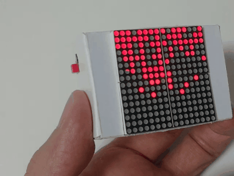
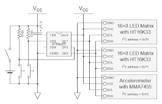
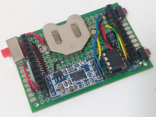
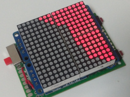

# ATtiny85FallingSand

A pseudo-falling-sand toy using an ATtiny85.

## Instruction

* Some LEDs of the 16&times;16 LED matrix light like sands in a box. You can enjoy falling sands by tilting the device.
* The amount of sand can be changed by pressing one button.
* The arrangement pattern of the wall can be changed by pressing the other button.
* If it's powered on with holding both buttons down, the maintenance mode starts.
  * You can check current values of the axis accelerometer.
  * The calibration procedure will starts by holding both buttons down for a while. If it starts, place the device on a flat surface.

## Hardware

### Components

* An [ATtiny85](https://akizukidenshi.com/catalog/g/g109573/)
* Two [16&times;8 LED matrix modules with HT16K33](https://aliexpress.com/item/1005007262961209.html)
  * One module must be tuned to be assigned I2C address to 0x71 (default is 0x70)
* A [3 axis accelerometer module with MMA7455](https://www.aitendo.com/product/10242)
* A battery holder and battery(ies)
* Two tactile switches
* A slide switch
* Two 10k&ohm; resistors
* A 0.1&mu;F electrolytic capacitor
* Wires, connectors, etc...

### Schematic

### Examples

## Software

### Build environment

[Install ATTinyCore boards to the Arduino IDE](https://github.com/SpenceKonde/ATTinyCore/blob/master/Installation.md) and configure the settings as follows.

Attribute        |Value
-----------------|------------------------------
Board            |ATtiny25/45/85 (No bootloader)
Chip             |ATtiny85
Clock            |16 MHz (PLL)
B.O.D. Level     |B.O.D. Disabled (saves power)
Save EEPROM      |EEPROM retained
Timer 1 Clock    |CPU (CPU frequency)
LTO              |Enabled
millis()/micros()|Enabled

### Acknowledgement

* [SimpleWire.h](https://lab.sasapea.mydns.jp/2020/03/11/avr-i2c-2/)
  * Copyright (c) 2020 Sasapea's Lab. All right reserved.

### License

These codes are licensed under [MIT License](LICENSE).

## References

* [Raspberry Pi LED Matrix Sand Toy by Ruiz Brothers| Adafruit Learning System](https://learn.adafruit.com/matrix-led-sand)
* [Falling-Sand-Matrix by witnessmenow | GitHub](https://github.com/witnessmenow/Falling-Sand-Matrix/tree/master)
* [LED MATRIX SHIELD 13x15 by tuenhidiy | AUTODESK Instructables](https://www.instructables.com/LED-MATRIX-SHIELD-13x15/)
* [LED Matrixで砂シミュレーション機をつくろう by kotaproj | Zenn](https://zenn.dev/kotaproj/articles/esp32_ledmat_fallingsand)
